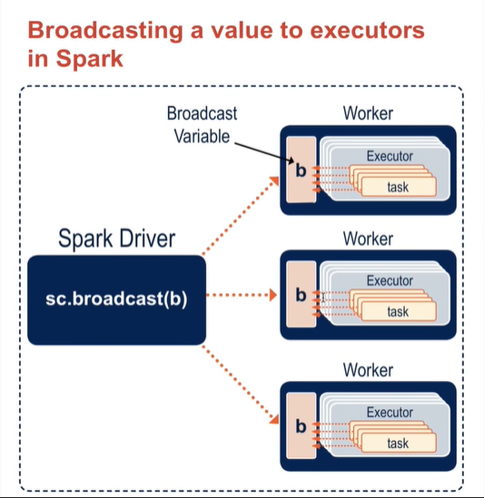

- RDD's cannot be broadcasted.
- RDD's need to be converted to Local Variables before broadcasting the data.
- To create a Local Variable we need to perform a action.
	- Data is sent from Worker Nodes(Executors) to Driver.
	- When Broadcasted, the data is sent from Driver to all the Nodes where the executors of the Spark Application are located.
	- This involves movement of data from Nodes to Driver and Driver to Nodes, leading to increased I/O operations.

// Good Read on the Broadcast as an expensive operation due to collect action involved
// https://stackoverflow.com/questions/38329738/how-to-transform-rdd-dataframe-or-dataset-straight-to-a-broadcast-variable-with

Examples of Broadcasted variable from
- Local File
- File in Cluster (RDD)

