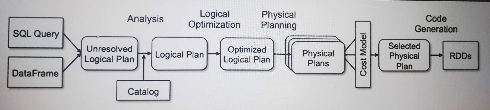

# Catalyst Optimizer #



- Structured API's (DF, DS, Spark SQL) perform better than Raw RDD's
- Catalyst optimizer will optimize the execution plan for Structured API's
- Rule Based Optimization.
	- Many rules are already available. Also if we want we can add our own optimization rules.

- Students.csv - 60 mb

|student_id |exam_center_id |subject |year |quarter |score |grade |
|-----------|---------------|--------|-----|--------|------|------|
|1 |1 |Math |2005 |1 |41 |D |
|1 |1 |Spanish |2005 |1 |51 |C |
|1|1|German|2005|1|39|D|
|1|1|Physics|2005|1|35|D|
|1|1|Biology|2005|1|53|C|
|1|1|Philosophy|2005|1|73|B|
|1|1|Modern Art|2005|1|32|E|

val df1 =
spark.read.format("csv").option("header",true).option("inferSchema",true).option("path","/Users/t
rendytech/Desktop/students.csv").load
df1.createOrReplaceTempView("students")
spark.sql("select * from students").show
1. Parsed Logical Plan - un-resolved
our query is parsed and we get a parsed logical plan - unresolved
it checks for any of the syntax errors.
syntax is correct
2. Resolved/Analysed Logical plan..
	- it will try to resolve the table name the column names etc..
	- if the columnname or table name is not available then we will get analysis exception.
	- if we have referred to the correct columnnames and table name
3. Optimized Logical Plan - catalyst optimizer.
	- filter push down
	- combining of filters..
	- combining of projections
4. There are many such rules which are already in place.
5. If we want we can add our own rules in the catalyst optimizer.

### Consider you are doing a Aggregate ###
- As per the logical plan lets say it says we have to do Aggregate in physical plan..

### physical plan1 ###
sortAggregate

### physical plan2 ###
HashAggregate

- It will select the physical plan which is the most optimized one with minimum cost.
- This selected physical plan is converted to Lower Level API's

a * b
if b is 1 then return a 
### Catalyst optimizer ###
val df1 = spark.read.format("csv").option("header",
true).option("inferSchema",true).option("path","/Users/trendytech/Desktop/students.csv").load
df1.createOrReplaceTempView("students")
spark.sql("select student_id from (select student_id, exam_center_id from students) where
student_id <5").explain(true)
spark.sql("select student_id,sum(score) from (select student_id, exam_center_id,score from
students where exam_center_id=5) where student_id < 5 group by student_id ").explain(true)

```
import org.apache.spark.sql.catalyst.plans.logical.LogicalPlan
import org.apache.spark.sql.catalyst.rules.Rule
import org.apache.spark.sql.catalyst.expressions.Multiply
import org.apache.spark.sql.catalyst.expressions.Literal
object MultiplyOptimizationRule extends Rule[LogicalPlan] {
def apply(plan: LogicalPlan): LogicalPlan = plan transformAllExpressions {
case Multiply(left,right) if right.isInstanceOf[Literal] &&
right.asInstanceOf[Literal].value.asInstanceOf[Integer] == 1 =>
println("optimization of one applied")
left
}
}
spark.experimental.extraOptimizations = Seq(MultiplyOptimizationRule)
```
