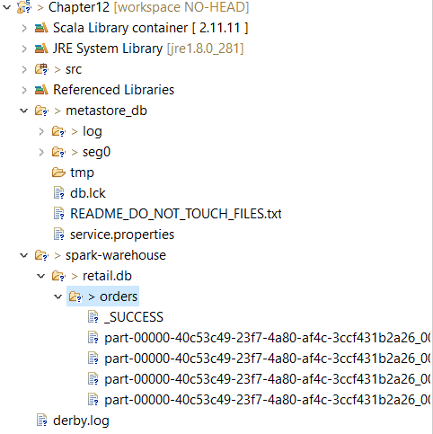

**Bucketing**
- Similar to Bucketing in Hive, creating buckets to store data based on a column with HIGH cardinality.
- .bucketBy(<num>, <cols>)

**Save Data to Table**
- Data is stored in Table as persistent storage for downstream applications to use the transformed data.
- .saveAsTable(<table_name>)

**Table Storage and Metadata**
- *Data stored as Tables using Spark Framework*
1. Storage location called as **Spark warehouse** can be configured
2. spark.sql.warehouse.dir attribute needs to be configured.
- *Metadata is stored in Catalog metastore*
1. By default it is maintained in-memory (on terminating the application it is gobe)
2. we can use hive metastore to handle spark metastore (for that we need to enableHiveSupport() while creating the Spark Session)
3. With Spark ver 2.4.4, and Scala ver 2.11 the Hive Metastore connection is not provided by default and need to add a jar.
4. URL: https://mvnrepository.com/artifact/org.apache.spark/spark-hive_2.11/2.4.4
- *Create Database and Table utilizing the Hive Metastore and view all tables in Catalog metastore*
1. spark.sql("create database if not exists retail"), df.saveAsTable("retail.orders")
2. spark.catalog.listTables("retail").show()
	

