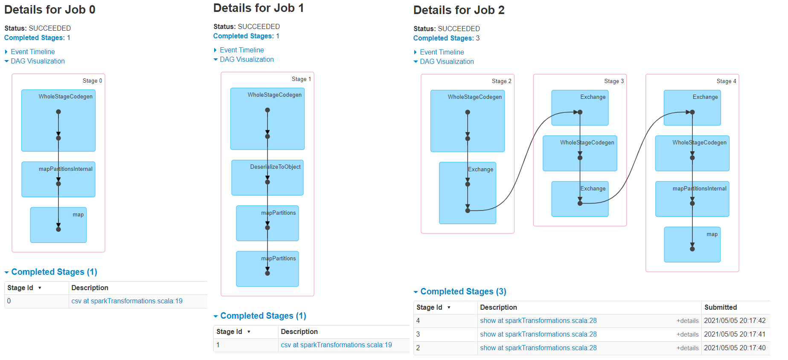

- Number of JOBS is ideally equal to number of ACTIONS
- each JOB will have STAGES - number of SHUFFLE boundaries
- each STAGE will have TASKS - number of PARTITIONS

- Job 0 - Read the CSV file and create mapinternalpartitions - File exists in Local Disk, needs to inferPartitions (to create an RDD with Partitions) and hence an ACTION
i.e. Every Action = Job
- Job 1 - InferSchema = True, leads to Data Serialization: to materilaize the data for infering the data types, which is an ACTION
- Job 2 - groupedDF.show() is an ACTION
	- Stage 1 - Repartition the data which is a WIDE TRANSFORMATION.
	- Stage 2 - Map operation for FILTER AND SELECT OPERATION is a NARROW TRANSFORMATION.
	- Stage 3 - groupBy operation is a WIDE TRANSFORMATION, count() is a NARROW TRANSFORMATION.
	- When there is a WIDE Transformation, the DAG shows 'Exchange' which is nothing but a INTERNAL Buffer.
	- INTERNAL Buffer is DISK space to which the Spark writes before it moves on to executing the next STAGE.
	- It READS from this internal BUFFER at the start of the NEXT STAGE.

Spark count() function is a Action? or Tranformation?

https://stackoverflow.com/questions/52966347/spark-is-count-on-grouped-data-a-transformation-or-an-action

The .count() what you have used in your code is over RelationalGroupedDataset, which creates a new column with count of elements in the grouped dataset. This is a transformation.
Refer: https://spark.apache.org/docs/1.6.0/api/scala/index.html#org.apache.spark.sql.GroupedDataset

The .count() that you use normally over RDD/DataFrame/Dataset is completely different from the above and this .count() is an Action.
Refer: https://spark.apache.org/docs/1.6.0/api/scala/index.html#org.apache.spark.rdd.RDD

always use .count() with .agg() while operating on groupedDataSet in order to avoid confusion in future:

empDF.groupBy($"department").agg(count($"department") as "countDepartment").show
