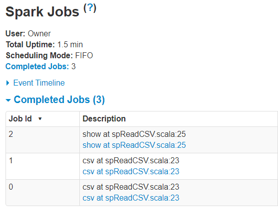

Read CSV script has 3 Actions (Jobs)

- Job 0 - To read the file, Spark creates internal partitions to construct the underlying RDD, this creates an action
- Job 1 - To infer the schema, the data (sample of records) needs to be serialized, this creates an action
- Job 2 - To display the data, this creates an action
